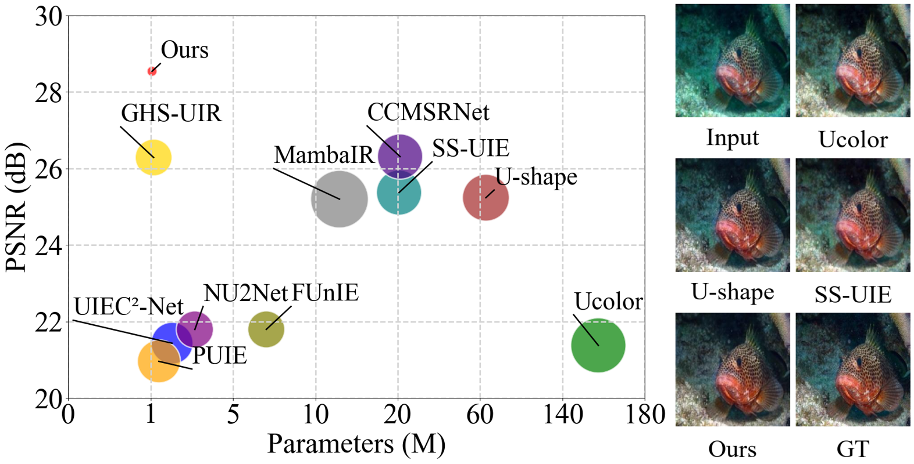
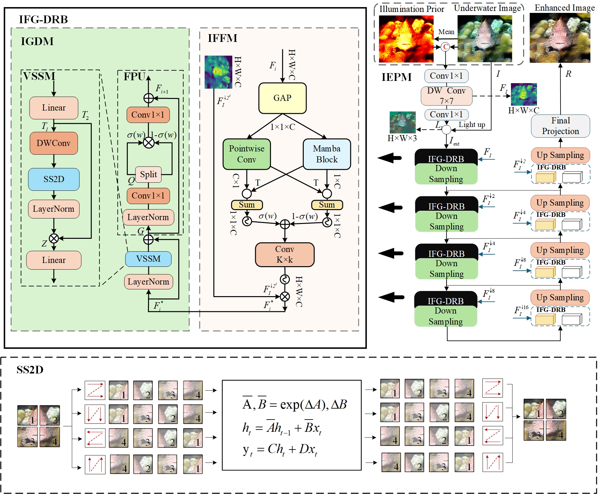
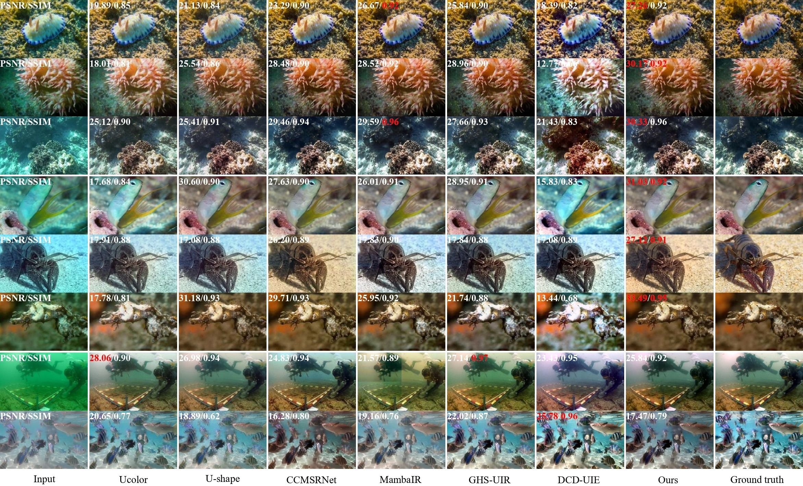
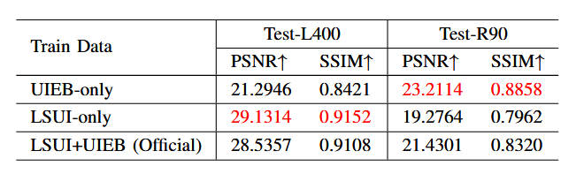
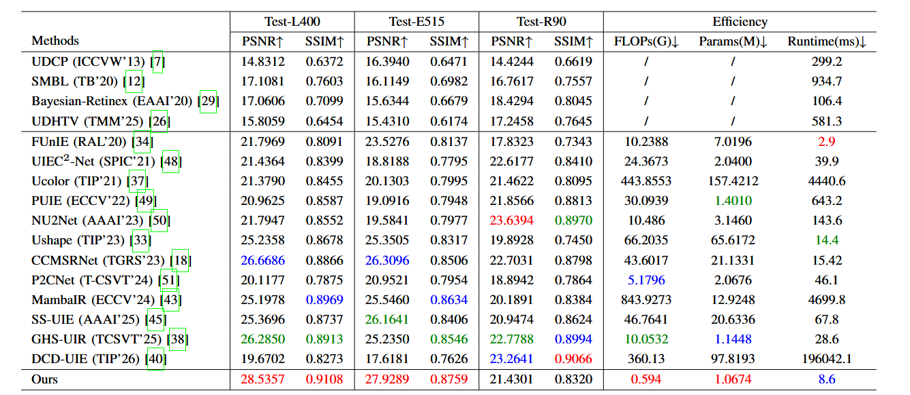

# HRMamba: A Hybrid Retinex and State-Space Model for Underwater Image Enhancement

<p align="center">
     <br>
</p>

> Underwater light absorption and scattering lead to severe color distortion, reduced visibility, contrast loss, and a significant degradation in image quality, thereby impeding both human visual analysis and machine vision tasks.Although considerable progress has been achieved in improving image quality, existing deep learning-based methods for underwater image enhancement (UIE) remain constrained by high computational complexity and insufficient modeling of global dependencies, which restricts their practical deployment in resource-limited underwater environments.To tackle these issues, we propose a novel hybrid framework integrating Retinex theory and state-space models (SSMs) for underwater image enhancement, named HRMamba.
> Different from existing Transformer-based approaches constrained by quadratic complexity, HRMamba attains computational efficiency through linear-complexity state-space operations while maintaining global dependency modeling capabilities.
> Moreover, to achieve comprehensive feature fusion, an Illumination Feature Fusion Module (IFFM) is proposed, which synergizes the global dependency modeling of SSMs with the local adaption capability of convolutional neural networks (CNNs). For context-sensitive noise suppression with illumination awareness, we propose an Illumination-Guided Denoising Module (IGDM) that employs directional-scanning Vision State Space Module (VSSM) blocks.
> Experiments demonstrate that HRMamba achieves state-of-the-art enhancement quality via an efficient architecture, significantly improving color fidelity and visibility restoration while  substantially reducing computational demands.

<p align="center">
     <br>
</p>

<p align="center">
   <br>
</p>

### 1. Clone the repository

```bash
git clone https://github.com/YeFan-web/HRMamba.git
cd HRMamba
```

### 2. Set up environment

- Make Conda Environment
```bash
conda create -n HRMamba python=3.10
conda activate HRMamba
```
Run the script to automatically create and configure the conda environment:

```bash
bash install_env.sh
```

## 🚀 Training

If you need to train our HRMamba, we use two underwater image enhancement datasets: **UIEB** ([link](https://li-chongyi.github.io/proj_benchmark.html)) and **LSUI** (available on [BaiduYun](https://pan.baidu.com/s/1dqB_k6agorQBVVqCda0vjA) password: `lsui` or [GoogleDrive](https://drive.google.com/file/d/10gD4s12uJxCHcuFdX9Khkv37zzBwNFbL/view)).  

Specifically, we use **3879 pairs from LSUI** and **800 pairs from UIEB** as the training set (4679 pairs in total). 

To facilitate reproduction, we provide a merged and pre‑split training dataset as used in our paper. You can download it from: [BaiduYun](https://pan.baidu.com/s/1dDOK0albAQfSFja5W94F0g?pwd=1234) (password: `1234`) and [GoogleDrive](https://drive.google.com/file/d/1LVGSCFEl55swlxvBMzNdM-C8vAa1AhKs/view?usp=drive_link)

After downloading and extracting the zip file, place the extracted folder into the `./datasets` 

Then, simply run the training script:

```bash
python ./train.py
```
## 📊 Testing

For your convenience, we provide some example datasets in `./datasets/testDataset` folder.
We also provide pretrained models in `./pretrained_models`
```bash
python test.py
```
The enhanced results will be saved automatically. To compute quantitative metrics (PSNR, SSIM, UIQM, UICQE, etc.), run:
```bash
python evaluate.py
```
To evaluate the model trained on a specific dataset, run the corresponding command below:
```bash
python test.py --model ./pretrained_models/HRMamba-UIEB.pth
```
```bash
python test.py --model ./pretrained_models/HRMamba-LSUI.pth
```

<details>
<summary>Quantitative Results </summary>
<p align="center">
   <br>
   <br>
</p>
</details>


## Citation
    @ARTICLE{10129222,
      author={Ye Fan, Lina Gao, Fuheng Zhou, Ning Li and Yulong Huang},
      journal={IEEE Transactions on Image Processing}, 
      title={HRMamba: A Hybrid Retinex and State-Space Model for Underwater Image Enhancement}, 
      year={2026},
      volume={},
      number={},
      pages={},
      doi={10.1109/TIP.2026.3689407}}


